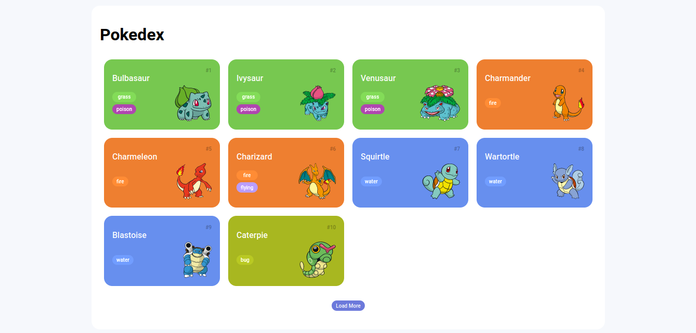

<h1 align="center">| JS-Web-Developer-Training-DIO  |</h1> 
<p align="center"></p>
<br>
<p align="center">
  
  
  
  
  
</p>
<br>
<hr>

### Tópicos 

:small_blue_diamond: [Descrição do projeto](#descrição-do-projeto)

:small_blue_diamond: [Funcionalidade](#funcionalidade)

:small_blue_diamond: [Deploy da Aplicação](#deploy-da-aplicação-dash)

:small_blue_diamond: [Como usar](#como-rodar-a-aplicação-arrow_forward)
<br><br>

## Descrição do projeto 
<p> 
  Este repositório é o resultado do meu trabalho durante um bootcamp de JavaScript.  
  
  Aqui, você encontrará anotações detalhadas e código-fonte relacionado ao projeto desenvolvido durante o curso.
  
  As anotações fornecem insights sobre a implementação e o desenvolvimento, enquanto o código está organizado no diretório `pokedex/`.

  <br>
</p>

<br>

<hr>

## Funcionalidade

:heavy_check_mark: Guardar projetos desenvolvidos  e insights adicionais do bootcamp.

<hr>

## Deploy da Aplicação :dash:

###   Projeto - Pokedex
> [Pokedex](https://pokedex-project-dio.netlify.app/)
<br>


<br>

<hr>

## Como Usar :arrow_forward:

No terminal, clone o projeto: 

```
git clone https://github.com/gknpp23/JS-Web-Developer-Training-DIO
```
<br>

1. Todos as anotações e exemplos estão dentro das pastas com nome **Cap_01** a **Cap_03**.
2. Explore a pasta `pokedex/` para revisar o código-fonte.


<br>

<hr>

Espero que este recurso seja útil para quem procura aprender mais sobre JavaScript e acompanhar meu progresso durante o bootcamp.

<hr>

## Licença 

The [MIT License]() (MIT)

Copyright :copyright: 2022 - Formação JS DIO.

<hr>

<h2 align="center"> <em>&lt;/&gt;</em>  by <a href=https://github.com/gknpp23" target="_blank">Gabriel Knupp</a> </h2>
